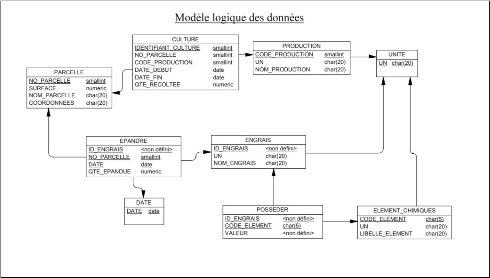
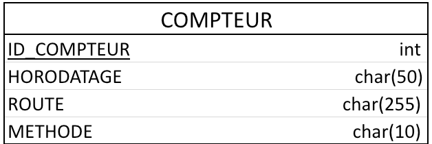

# Projet API – Backend

## Database

 
#### Schema de la base de données

---


#### Table Compteur 

## Description

Ce projet consiste en la création d'une API permettant à un Frontend d'exploiter une base de données 
destinée à gérer les rendements des parcelles d'une exploitation agricole.

## Objectif

L'objectif principal de ce projet est de fournir aux Frontend d'accéder et de manipuler les données de la base de données agricole.

## Routes

| Routes                  | Methodes                      |        
|-------------------------|-------------------------------|
| /api/cultures           | POST, DELETE, GET, PUT, PATCH |
| /api/productions        | POST, DELETE, GET, PUT, PATCH | 
| /api/parcelles          | POST, DELETE, GET, PUT, PATCH | 
| /api/epandre            | POST, DELETE, GET, PUT        | 
| /api/dates              | POST, DELETE, GET             | 
| /api/engrais            | POST, DELETE, GET, PUT, PATCH | 
| /api/posseder           | POST, DELETE, GET, PUT        | 
| /api/elements_chimiques | POST, DELETE, GET, PUT, PATCH | 
| /api/unites             | POST, DELETE, GET             | 
| /api/compteur           | GET                           |

Pour d'autres informations, consultez le Miro

---

### Token

| Route           | Methode |
|-----------------|---------|
| /api/auth/jwt   | GET     |

## Liens

#### Miro : https://miro.com/app/board/uXjVNcPF3u0=/?share_link_id=274411522119

---

#### Trello : https://trello.com/invite/b/SBPUChQp/ATTI29b5c2957931f500bb3276edf9dc5b9a5D4483F3/projet-api

---

#### Postman : https://app.getpostman.com/join-team?invite_code=7259258bca781123637e3f034810580d&target_code=cf68b552ebe9cdafdbf41a1e4d8b6076

## Lancement du projet

### Récupération de la base de données

#### Étape 1 :
Créer une base de données, avec le nom que vous voulez dans une version supérieur ou égale à postgres16.

#### Étape 2 :
Rajoutez dans le dossier L2_PARIS_API un fichier .env avec ces informations :
```
DB_NAME="(le nom de votre base de données)"  
DB_USER="(votre user)"  
DB_HOST="(votre host de la base de données)"
DB_PASSWORD="(votre mot de passe)"
JWT_SECRET=(clé aléatoire)
HOST=(votre host de l'api)
PORT=(votre port de l'api)
```

#### Étape 3 : 
Une fois les étapes précédentes réalisée, vous pouvez récupérer la base de données en lançant le ficheir ```database.py```

## Récupérer les packages

Dans votre terminal, rentrez la commande ```pip3 install -r "requirements.txt```

## Lancer le projet
Une fois les étapes précédentes faites, dans votre terminal, rentrez la commande ```uvicorn main:app --reload```

